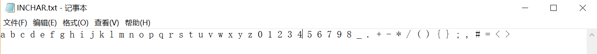
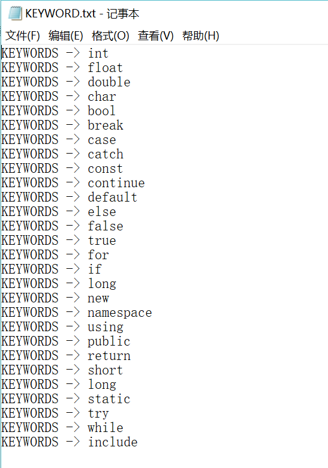
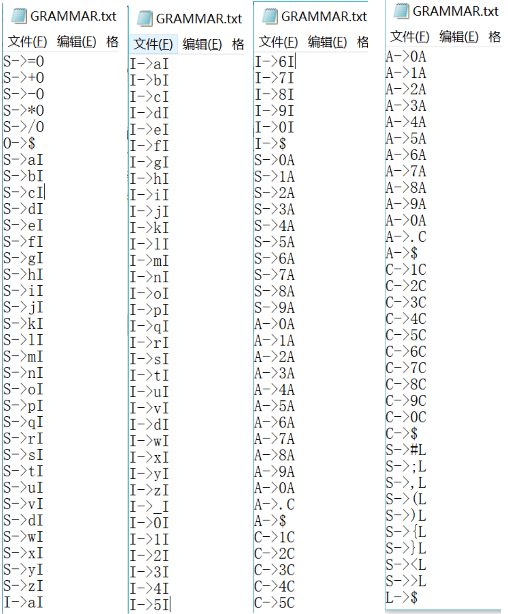
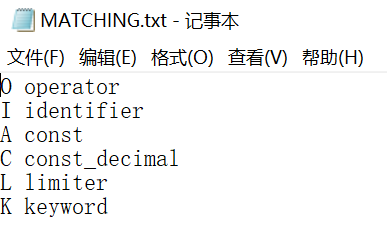
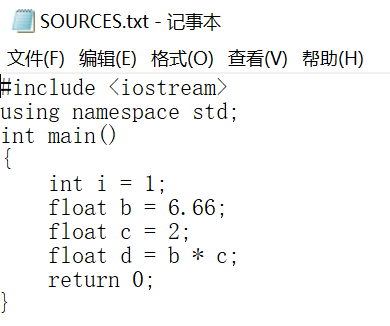
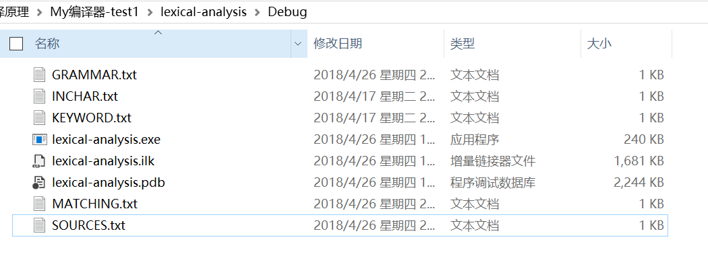
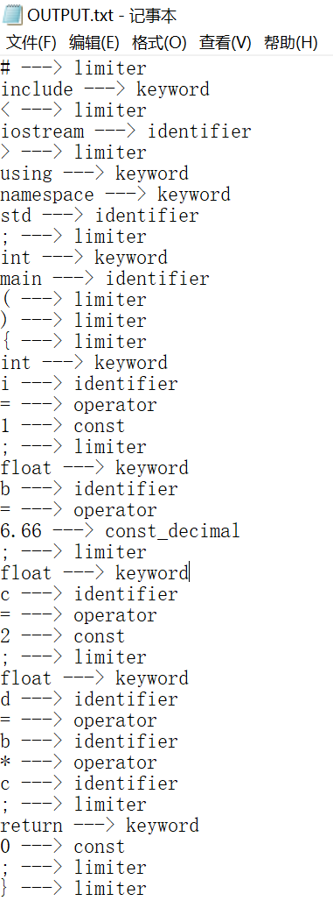

# Lexical-Analyzer And Phaser-Analyzer （词法分析器和语法分析器）

该项目是基于 **南京理工大学编译原理课程作业** 实现的, 非常感谢教学团队的指导！

项目中 [Executable Files](Executable Files) 文件夹内为可执行文件，[Source Files](Source Files) 文件夹内为源文件。该项目编译环境如下：

## 编译环境

- 使用系统：Windows 10
- 编程语言：C++
- 编程工具：Visual Sudio 2017

## Task 1: Lexical-Analyzer（词法分析器）

### 一、任务

Task 1: Create a lexical analysis program, which supports analyzing regular grammar. 

You  must  use  DFA  (Deterministic  Finite  Automata) or  NFA  (Nondeterministic  Finite  Automata) to implement this program

The inputs of the program are a text document including  a set of productions of 3º grammar (the regular grammar and a source code text document contains a set of strings to be recoganized. The output of the program is a token table which consists of 5 types token: key words identifier const, limiter and operator.    

任务1：创建一个词法分析程序，该程序支持对常规语法的分析。

您必须使用DFA（确定性有限自动机）或NFA（非确定性有限自动机）来实施此程序

程序的输入是一个文本文档，包括一套3º语法的产品（常规语法）和一个源代码文本文档，其中包含一组要重新识别的字符串。 程序的输出是一个由5种类型的令牌组成的令牌表：关键字，标识符，常量，限制符和运算符。

### 二、实现思路

若实现可以识别用户自定义语言的词法分析器，则首先需要识别用户提供的**关键字(key words)**、**标识符(identifier)**、**常数(count)**、**界符(limiter)**、**操作符(operator)**以及**3型文法（3º  grammar）**。其次要根据用户提供的文法构建NFA和DFA。最后将要执行分析的源文件放入DFA中以得到结果。

### 三、设计实现

该词法分析器需要提供5个TXT文件，其内容和作用分别如下：

#### 1. INCHAR.txt

**INCHAR.txt** 中定义了该语言所能输入的字符。注意该语言中所有可以使用的字符都应在 **INCHAR.txt** 中定义。在编译过程中，如果发现未在 **INCHAR.txt** 中定义的字符将会输出“ERROR”并结束。其文件内容如下例：

#### 2. KEYWORD.txt

KEYWORD.txt中定义了该语言的关键字。其文件内容如下例：

#### 3. GRAMMAR.txt

**GRAMMAR.txt** 中定义了该语言的文法，该例中设计了一个三型文法，分别用各个终态表示一类单词。对应关系和描述如下：

|  符号  |  类型  |  备注  |		
| :---: | :---: | :---: |
| O	| 运算符 | 有 = 、+ 、- 、* 、/  5个符号 |
| I	| 标识符 | 以字母开头，后面可以跟字母、数字、下划线 |
| A	| 整型常数 | 整数（如：1 , 22 , 333）|
| C	| 小数型常数 | 小数型常数（如：1.1 , 2.22 , 3.333）|
| L	| 界符 | 有 # 、 ； 、 ， 、 （ 、 ） 、{ 、} 、< 、 > |

备注：关键字KEYWORD保存在KEYWORD.txt中。

其文件内容如下：

#### 4. MATCHING.txt

**MATCHING.txt** 中定义了要将 **GRAMMAR.txt** 中定义的符号匹配成用户自定义的符号，其内容如下例：

其对应关系为：
- O匹配成operator
- I匹配成identifier
- A匹配成const
- C匹配成const_decimal
- L匹配成limiter
- K匹配成keyword

#### 5. SOURCES.txt

**SOURCES.txt** 即用户要进行词法分析的代码段。如下例：

注：EXE文件的目录中一定要有以上五个文件，不然运行会提示未找到XX文件，无法继续分析。其文件目录应如下图所示：

### 四、运行结果

本次示例使用的文件内容均如上截图内容所示，其执行结果为：

分析的结果会保存一份到 *"./OUTPUT.txt"* ，如下图：

